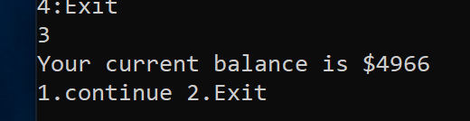

# lab02-unit-testing

This is a simple ATM machine which has 4 choices in the main menu: Deposite, Withdraw, View Balance, Exit.
For Deposite, Withdraw and view Balance options, after complete the current transaction, users have two choices which are 
continue to another transaction or exit the system

The main menu looks like this:

When you choose 1.Deposite, it will ask you how much money you want to do with this transaction, if you type negative 
number or 0,it will show error,the number has to be positive and after this, it will ask you if you want to continue or exit

When you choose 2.Withdraw, it will ask you how much money you want to withdraw from your account, the amount you type in
can't be negative or larger than your current balance, otherwise it will show error

When you choose 3 View Balance, it will tell you your current balance. And you also can choose to continue or exit.

If you press enter instead of typing a number at very beginning , it will tell you to choose one from the menu.